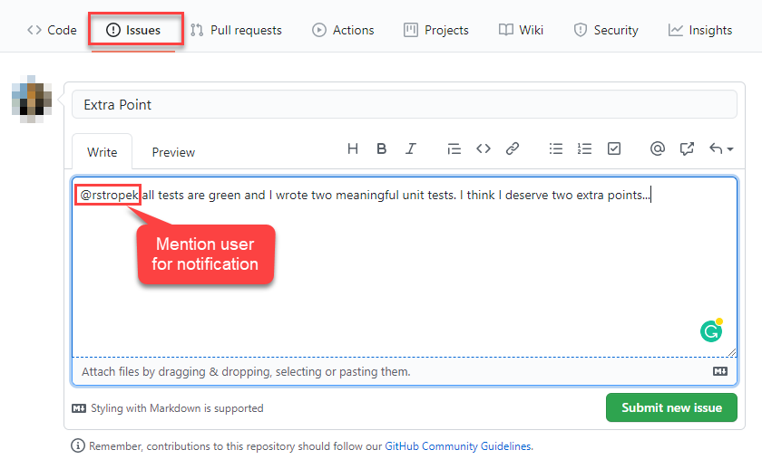
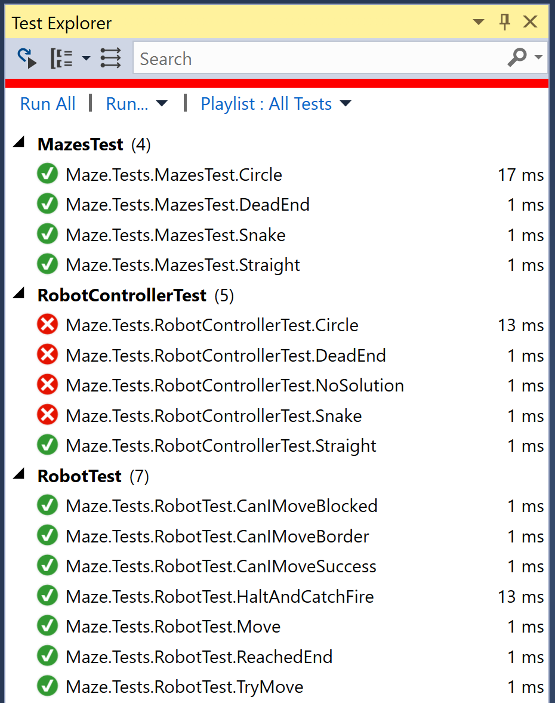

# *Robot Maze* Quiz

## Introduction

In this quiz, you have to write an algorithm that directs a fictitious robot out of a maze. Your robot knows to perform a few simple operations (see [IRobot](Maze.Library/IRobot.cs)). Each method stub in [IRobot](Maze.Library/IRobot.cs) contains a detailed specification in the inline C# documentation.

To solve the quiz, implement the method `MoveRobotToExit` in [RobotController.cs](Maze.Robot/RobotController.cs). You can check if your code is correct by running the unit tests in [Maze.Tests](Maze.Tests).

1. Everybody has to do his/her best to come up with a solution. **You must check in your code in GitHub**.

1. Earn one extra point for your grade by delivering a solution that passes all unit tests. 

1. Too easy for you? I have an **extra challenge**: Earn an additional extra point for your grade if you build at least one *meaningful* (not trivial!) unit test to the [*Maze.Tests*](Maze.Tests) project. We have not covered writing unit tests in class but I am pretty sure you will figure out how they work by examining the existing tests and doing some online research.

If you think you deserve one or two extra points, send me a message via a GitHub issue in your homework's repository.

## Hints

1. Open the provided solution [Maze.sln](Maze.sln) in Visual Studio 2019 Preview and use the included code as a starting point.

1. In Visual Studio, open the *Test Explorer*. You will see all the unit tests. Initially, some will fail because the implementation is missing. Your goal is to make sure that all tests become green.

