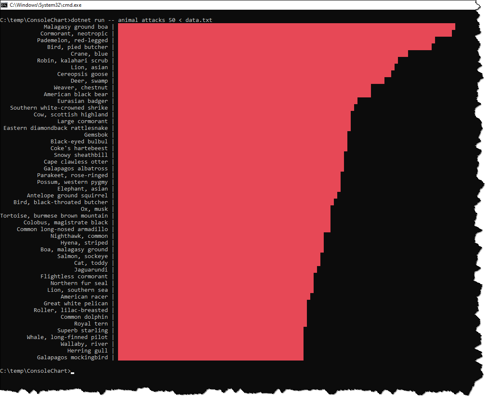

# Console Chart Exercise

## Introduction

You got a [tab-delimited data file](data.txt) with data about animal attacks in various countries (note: the data has been randomly generated for this exercise). You job is to write a C# program that can display a vertical bar chart on the console visualizing the data in the file.

Here is an example for the output that you have to generate:

Everyone has to hand in his or her best try using GitHub Classroom. If you think you deserve extra points, let me know via a GitHub issue.

## Basic Requirements

* Use .NET 5 and the latest preview version of C#.

* You have to read the data from *stdin*. For that, your app will be called with a *stdin* redirection (e.g. `yourapp ... < data.txt` or `dotnet -- ... < data.txt`).

* Write a console app that receives two parameters via the command line:
  * Grouping column: Name of the column by which to group the list (e.g. *animal*).
  * Numeric column: Name of the column to summarize (e.g. *attacks*).

* You have to calculate the sum of the given numeric column for each distinct value of the grouping column. Example: If the parameters are `animal attacks < data.txt` you have to calculate the sum of the column *attacks* for each distinct *animal* from *data.txt*.

* You have to print a vertical bar chart as shown above. The grouping column has to appear right-aligned. The maximum value for the numeric column has to result in a solid red bar with length 100 characters. The other bar lengths have to calculated in relation to it (e.g. if maximum value is 10000 and the current value is 7500, the length of this bar would be 7500 / 10000 * 100 = 75 characters).

* If you already know how to use Linq, you can use it. However, it is not required to use Linq. You can also do the calculations with regular collections like `List<T>`, `IEnumerable<T>`, `Dictionary<TKey, TValue>`, etc.

## Extra Challenges

* You can earn one extra point if you sort the resulting table by the sum of the numeric value (descending). The result will look similar as the sample output shown above.

* You can earn a second extra point if you add a third command line parameter with which a user can limit the maximum number of lines in the table (e.g. `animal attacks 25 < data.txt` should display the 25 animals with the highest number of attacks).

## Technical Tips

* You do not need to handle errors. You can assume that all command line arguments are present and meaningful. You do not need to check for invalid data in the input file.

* You can assume that the numeric column contains integer values. Therefore, you can parse them using `Int32.Parse`.

* You can read and set the background color for console output using `Console.BackgroundColor`.

* If you do not use Linq, you could consider using [`List<T>.Sort`](https://docs.microsoft.com/en-us/dotnet/api/system.collections.generic.list-1.sort).
