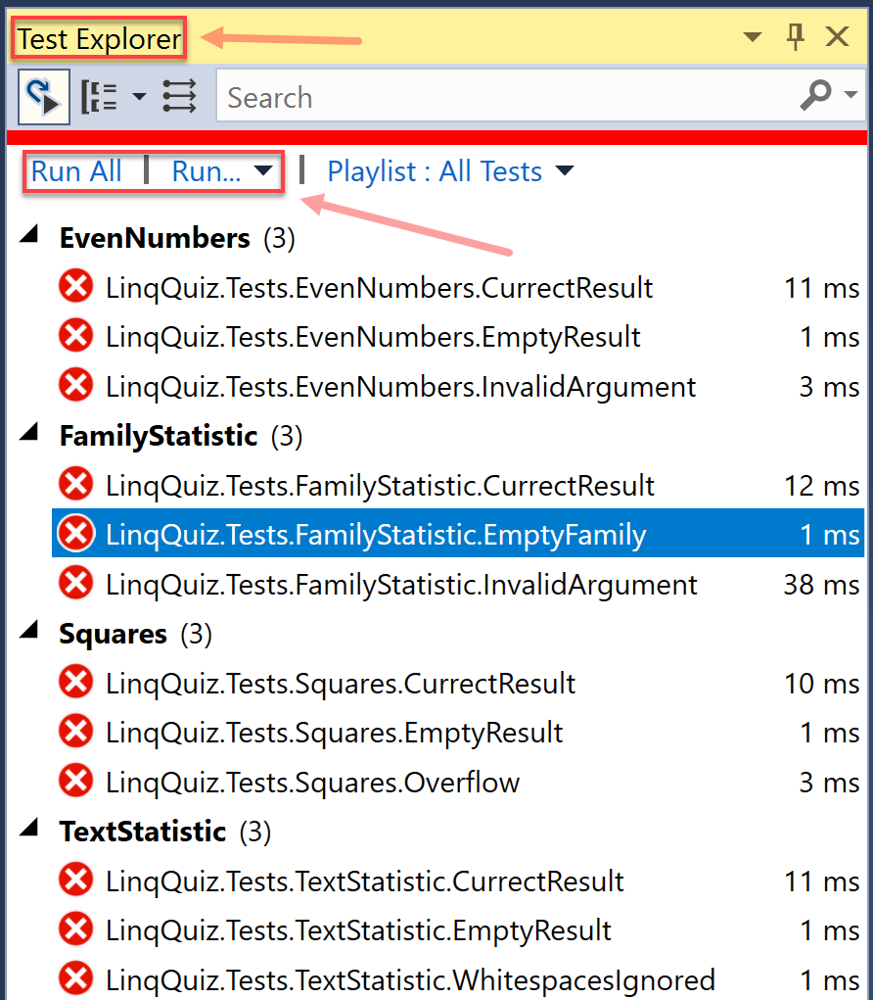

# LINQ Quiz

## Introduction

Implement all methods in [Quiz.cs](LinqQuiz.Library/Quiz.cs). You can check if your code is correct by running the unit tests in [LinqQuiz.Tests](LinqQuiz.Tests).

Each method stub in [Quiz.cs](LinqQuiz.Library/Quiz.cs) contains a detailed specification in the inline C# documentation:

1. Everybody has to do his/her best to come up with a solution.

1. Earn one point for your grade by delivering a solution that passes all unit tests.

1. Earn my **deepest respect** ;-) if you manage to implement each method correctly in a single line of code. It is possible.

## Hints

1. Before starting the quiz, make yourself familiar with [*LINQ*](https://docs.microsoft.com/en-us/dotnet/csharp/programming-guide/concepts/linq/introduction-to-linq-queries). You can solve the quiz without *LINQ* but you will have to write many more lines of code.

1. Open the provided solution [LinqQuiz.Library.sln](LinqQuiz.Library.sln) in Visual Studio 2019 and use the included code as a starting point.

1. In Visual Studio, open the *Test Explorer*. You will see all the unit tests. Initially, all will fail because the implementations are missing. Your goal is to make sure that all tests become green.

