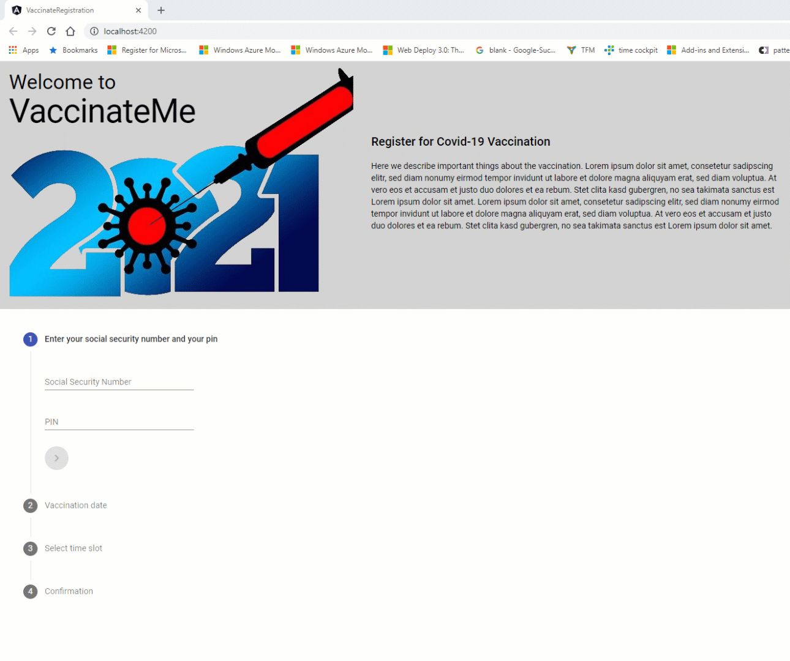
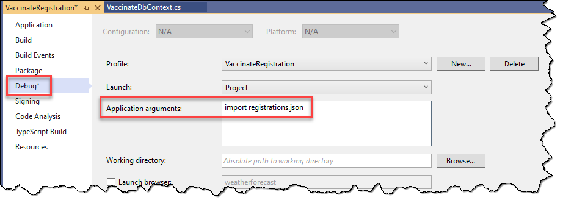

# Vaccination Registration

## Introduction

You agreed to help a local doctor by creating a website for people who want to register for a Covid-19 vaccination.

The doctor has sent out letters to interested patients. Each letter contained a personal PIN code for the patient. Patients who would like to arrange a vaccination date should go the website you have to implement, enter their *Social Security Number* (short *SSN*) and their PIN.

If SSN and PIN are correct, they can *pick a date*. The doctor will offer vaccinations *between January 18th and 20th 2021*.

Once they picked a date, they can select a *time slot*. The doctor offers time slots based on the following rules:

* The doctor starts at 8am and has to leave at 11am.
* The doctor wants to have enough time for each patient, so he *reserves 15 minutes for each patient* registered for a vaccination. As a result, *12 time slots* should be available on each day:
  * 8:00am
  * 8:15am
  * 8:30am
  * ...
  * 10:30am
  * 10:45am
* Once a patient has registered for a time slot, no other patient can take the time slot.

If you complete all challenges of the quiz, the UI should work like this:

## Data Model

Your software must store data about *registrations* and *vaccinations*.

* *Registration* means that the patient has shown interest in the vaccination. Therefore, the doctor has sent the patient a PIN code. For each registration, you have to store the following properties:
  * Social Security Number
  * PIN code
  * First name
  * Last name
  * Optional reference to the vaccination appointment, if the patient has already created one.
* *Vaccinations* are appointments for a vaccination with date and time slot. For each vaccination, you have to store the following properties:
  * Vaccination appointment's date and time
  * Mandatory reference to the registration that the appointment is based on. It must not be possible to create a vaccination appointment without a registration.
* Every record in every table has to have an auto-generated numeric primary key (type `int`)

## Starter Code

To make your life easier, you get a [starter solution](starter/VaccinateRegistration) with existing code. You only have to fill in the blanks.

Additionally, you get a ready-made [Angular client](starter/VaccinateRegistration.UI) that you can use to verify the correctness of your code. You **must not make changes** to the Angular UI. It is complete and needs no changes. Here are some tips for how to use the Angular UI:

* Install the dependencies by running `npm install` inside the *VaccinateRegistration.UI* folder.
* Start the Angular UI by running `npm start` inside the *VaccinateRegistration.UI* folder.
* You can start the Angular UI and keep it running while working on the C# part of the quiz. It is *not* necessary to restart the Angular UI whenever you restart your C# solution.
* For those of you who cannot or don't want to build and run the Angular UI locally, an online version of the Angular UI is available at [https://stackblitz.com/edit/angular-vaccination?file=src/app/app.component.ts](https://stackblitz.com/edit/angular-vaccination).

Take some time to make yourself familiar with the starter solution and the Angular UI. It is part of the exercise to learn how to read and extend existing code.

## Minimum Requirements

Your code **must** compile without errors.

You must solve at least the following requirements for a positive grade:

* Complete the data model classes so that they can fulfill the data model requirements stated above. You can make meaningful assumptions for technical details that have not been defined in the requirements.
* Extend the EFCore database context class `VaccinateDbContext` so that you can generate EFCore migrations and create a database.
* Add *at least* the following helper methods for the following tasks to the EFCore database context class. Stubs for the methods are already in the EFCore database context class `VaccinateDbContext`. You just have to add the implementation.
  * `ImportRegistrations`: Import registrations from a JSON file ([*registrations.json*](starter/VaccinateRegistration/registrations.json)). You can trigger the import by starting the ASP.NET Core application with the command-line arguments `import registrations.json`.
    
  * `DeleteEverything`: Delete everything (registrations, vaccinations); this operation can be used to reset the system and during testing.
  * `GetRegistration`: Get a registration by SSN and PIN.
* Add *at least* the following web API endpoint to `RegistrationsController`:
  * `GetRegistration`: Get a registration by SSN and PIN.

## Additional Requirements

You grade will depend on the completeness and quality of the implementation of the following requirements:

### General Requirement

Use **async methods** for database access wherever technically possible.

### Get Timeslot (`VaccinateDbContext.GetTimeslots`)

Get all available time slots for a given day. You have to calculate all available time slots as described above and remove all time slots that have already been taken.

You **must not** hard-code all 12 available daily time slots in C#. Use any kind of C# logic (e.g. loop, Linq) to generate the time slots algorithmically.

### StoreVaccination (`VaccinateDbContext.StoreVaccination`)

**Create or update** a *vaccination* record. For the detailed specification see documentation of method stub.

### Transactions

All database operations of the following functions have to be done within a *DB transaction*:

* Import registrations
* Delete everything

### ASP.NET Web API

Add web API endpoints for the following operations. They have to use the methods of the EFCore database context.

* `RegistrationsController.GetTimeslots`
* `VaccinationsController.StoreVaccination`

## Technical Tips

* C# struct for handling date and time: `DateTime`
* [How to create a `DateTime` instance](https://docs.microsoft.com/en-us/dotnet/api/system.datetime?view=net-5.0#invoke-constructors)
* `DateTime` has [various methods](https://docs.microsoft.com/en-us/dotnet/api/system.datetime?view=net-5.0#invoke-constructors) to add hours (`AddHours`), minutes (`AddMinutes`), etc.
