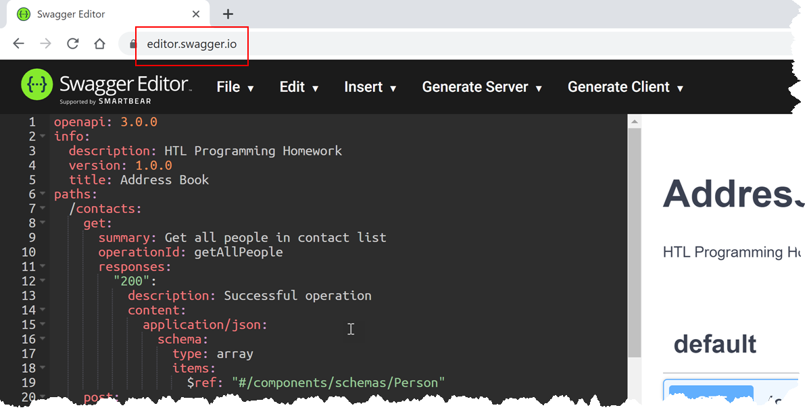

# *Contact List* Quiz

## Introduction

In this exercise, you have to implement RESTful Web API for maintaining a contact list.

1. Everybody has to do his/her best to come up with a solution.

1. Earn one point for your grade if you implement all requirements specified in the [*swagger.yaml*](swagger.yaml) file. Notify me via GitHub issue if you succeeded and want the extra points.

## Specification

1. Use C# and ASP.NET 5 to implement the Web API.

1. Your Web API must implement the technical specification defined in [*swagger.yaml*](swagger.yaml).

1. It is ok to maintain the list of contacts in memory (e.g. with `List<T>`). You do not need to use a DB and Entity Framework Core. We will bring together ASP.NET and EFCore in later exercises.

1. Add [*NSwag*](https://docs.microsoft.com/en-us/aspnet/core/tutorials/getting-started-with-nswag) to your implementation to generate *Open API Specification* (OAS) for your C# code. Add proper [*Data Annotations*](https://docs.microsoft.com/en-us/aspnet/core/tutorials/getting-started-with-nswag) to your controller methods so that the generated OAS file comes as close as possible to the [*swagger.yaml* file from this specification](swagger.yaml).

1. Build all your controller methods so that they return `IActionResult` or `ActionResult<T>` ([docs](https://docs.microsoft.com/en-us/aspnet/core/web-api/action-return-types)).

## Hints

1. View the [Swagger](https://swagger.io/) specification in the [Swagger Editor](https://editor.swagger.io). 
   
