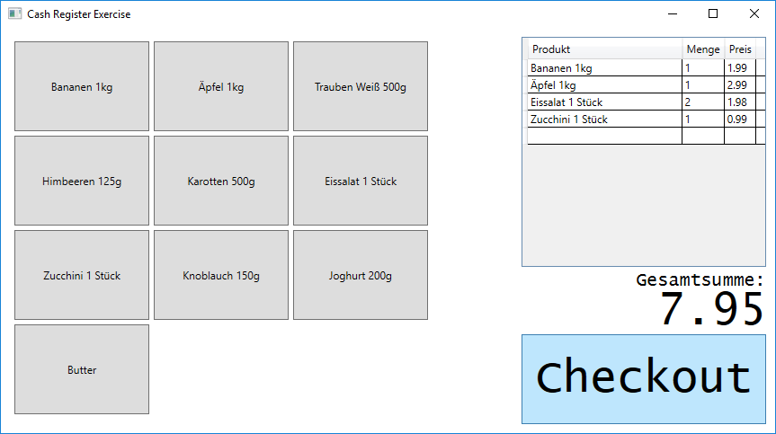

# WPF Cash Register Sample

## Introduction

In this exercise, you create a simple cash register. The final result should be a user interface that looks like this:



## Specification

* Create a backend Web API using ASP.NET Core and Entity Framework Core
* Create a frontend with WPF that uses the Web API backend.
* The database should store products. Every product consists of:
  * ID (numeric, unique key)
  * Product name (mandatory)
  * Unit price (numeric, mandatory)
* The database should store receipt lines. Every receipt line consists of:
  * ID (numeric, unique key)
  * Reference to the bought product
  * Amount of pieces bought
  * Total price (numeric, amount * product's unit price, calculated by backend)
* The database should store receipts. Every receipt consists of:
  * A list of receipt lines (at least one)
  * Receipt timestamp (auto-assigned by backend)
  * Total price (numeric, sum of total prices of all receipt lines, calculated by backend)

## Hands-on Lab

### Setting Up the Project

We want to build a WPF frontend with an ASP.NET Core Web API in the backend. The backend should use Entity Framework Core for accessing the database. Frontend and backend should *share the data model* that is necessary in both application tiers. Your first job is to setup the project in Visual Studio.

* Create a new *ASP.NET Core Web API* in Visual Studio. Use the project template for Web APIs offered by Visual Studio.
  * Proposed solution name: *CashRegister*
  * Proposed project name: *CashRegister.WebApi*
  * No need for OpenAPI support
  * Remove the generated sample code (*WeatherForecast.cs*, *Controllers/WeatherForecastController.cs*)

* Create a new *WPF App (.NET Core)* project to your solution
  * Proposed project name: *CashRegister.UICore*

* Add a new *Class Library* project to your solution
  * Proposed project name: *CashRegister.Shared*
  * Remove the generated sample code (*Class1.cs*)

* Create the dependencies between your projects
  * Create a dependency from *CashRegister.WebApi* to *CashRegister.Shared*
  * Create a dependency from *CashRegister.UICore* to *CashRegister.Shared*

* Add the setting `<Nullable>enable</Nullable>` to all projects (*.csproj* files)

* Add the necessary NuGet packages for Entity Framework Core to the *CashRegister.WebApi* project according to your [EF cheat sheet](https://github.com/rstropek/htl-leo-csharp-4/blob/master/slides/ef-aspnet-cheat-sheet.md)

### Create the Model

For our cash register, we need products, receipts and receipt lines. Here are proposed C# classes representing the model:

```cs
public class Product
{
    [JsonPropertyName("id")]
    public int ID { get; set; }

    [JsonPropertyName("productName")]
    public string ProductName { get; set; } = string.Empty

    [JsonPropertyName("unitPrice")]
    public decimal UnitPrice { get; set; }
}

public class ReceiptLine
{
    [JsonPropertyName("id")]
    public int ID { get; set; }

    [JsonPropertyName("product")]
    public Product Product { get; set; }

    [JsonPropertyName("amount")]
    public int Amount { get; set; }

    [JsonPropertyName("totalPrice")]
    public decimal TotalPrice { get; set; }
}

public class Receipt
{
    [JsonPropertyName("id")]
    public int ID { get; set; }

    [JsonPropertyName("receiptTimestamp")]
    public DateTime ReceiptTimestamp { get; set; }

    [JsonPropertyName("receiptLines")]
    public List<ReceiptLine> ReceiptLines { get; set; } = new();

    [JsonPropertyName("totalPrice")]
    public decimal TotalPrice { get; set; }
}
```

### Create and Configure the Data Context

* Add an Entity Framework data context class `CashRegisterDataContext` to the *CashRegister.WebApi* project according to your [EF cheat sheet](https://github.com/rstropek/htl-leo-csharp-4/blob/master/slides/ef-aspnet-cheat-sheet.md)

* Use the appropriate data context method (can be found in [EF cheat sheet](https://github.com/rstropek/htl-leo-csharp-4/blob/master/slides/ef-aspnet-cheat-sheet.md)) to ensure that *all* properties of the model are required (i.e. not nullable). Making the relations required is nice-to-have. Here is the proposed code for making the properties required:

    ```cs
    modelBuilder.Entity<Product>().Property(p => p.ProductName).IsRequired();
    modelBuilder.Entity<Product>().Property(p => p.UnitPrice).IsRequired().HasColumnType("numeric(6,2)");

    modelBuilder.Entity<ReceiptLine>().Property(rl => rl.Amount).IsRequired();
    modelBuilder.Entity<ReceiptLine>().Property(rl => rl.TotalPrice).IsRequired().HasColumnType("numeric(6,2)");

    modelBuilder.Entity<Receipt>().Property(r => r.ReceiptTimestamp).IsRequired();
    modelBuilder.Entity<Receipt>().Property(r => r.TotalPrice).IsRequired().HasColumnType("numeric(6,2)");
    ```

* Add a connection string to your SQL Server *LocalDB* to *appsettings.json* according to your [EF cheat sheet](https://github.com/rstropek/htl-leo-csharp-4/blob/master/slides/ef-aspnet-cheat-sheet.md). The connection string looks something like `Server=(localdb)\\MSSQLLocalDB;Database=AddressBook;Trusted_Connection=True`.

* Add the necessary code to register EF in `Startup.ConfigureServices` according to your [EF cheat sheet](https://github.com/rstropek/htl-leo-csharp-4/blob/master/slides/ef-aspnet-cheat-sheet.md).

* Create the migration code using Entity Framework command line tools (see [EF cheat sheet](https://github.com/rstropek/htl-leo-csharp-4/blob/master/slides/ef-aspnet-cheat-sheet.md) for details)

* Create the database schema using Entity Framework command line tools (see [EF cheat sheet](https://github.com/rstropek/htl-leo-csharp-4/blob/master/slides/ef-aspnet-cheat-sheet.md) for details)

* Add some demo data to the `Products` database table. Here are some sample SQL statements that you can use:

    ```sql
    insert into Products (ProductName, UnitPrice) values ('Bananen 1kg', 1.99)
    insert into Products (ProductName, UnitPrice) values ('Äpfel 1kg', 2.99)
    insert into Products (ProductName, UnitPrice) values ('Trauben Weiß 500g', 2.49)
    insert into Products (ProductName, UnitPrice) values ('Himbeeren 125g', 1.89)
    insert into Products (ProductName, UnitPrice) values ('Karotten 500g', 1.19)
    insert into Products (ProductName, UnitPrice) values ('Eissalat 1 Stück', 0.99)
    insert into Products (ProductName, UnitPrice) values ('Zucchini 1 Stück', 0.99)
    insert into Products (ProductName, UnitPrice) values ('Knoblauch 150g', 2.49)
    insert into Products (ProductName, UnitPrice) values ('Joghurt 200g', 0.49)
    insert into Products (ProductName, UnitPrice) values ('Butter', 2.59)
    ```

### Create Web APIs

* **Try to implement all Web API methods asynchronously using `Task`, `async`, and `await`**

* Create a Web API controller `ProductsController` with a method `Get` that returns all products
  * HTTP method: `GET`
  * Route: `/api/products`
  * Optional *query parameter* for filtering products based on the product name (e.g. `/api/products?nameFilter=Bana`)

    ```cs
    [ApiController]
    [Route("api/[controller]")]
    public class ProductsController : ControllerBase
    {
        private readonly CashRegisterDataContext DataContext;

        public ProductsController(CashRegisterDataContext dataContext)
        {
            DataContext = dataContext;
        }

        [HttpGet]
        public async Task<IEnumerable<Product>> Get([FromQuery]string? nameFilter = null)
        {
            IQueryable<Product> products = DataContext.Products;

            // Apply filter if one is given
            if (!string.IsNullOrEmpty(nameFilter))
            {
                products = products.Where(p => p.ProductName.Contains(nameFilter));
            }

            return await products.ToListAsync();
        }
    }
    ```

* Create a Web API to create a receipt
  * HTTP method: `POST`
  * Route: `/api/receipts`
  * Success status code: *Created* (201)
  * JSON body and C# model for *data transformation objects* (DTOs):

    *Example for a valid JSON body:*

    ```json
    [
        { "productID": 1, "amount": 2 },
        { "productID": 2, "amount": 1 }
    ]
    ```

    *C# classes for DTOs (find an appropriate place where to put them):*

    ```cs
    public class ReceiptLineDto
    {
        public int ProductID { get; set; }
        public int Amount { get; set; }
    }
    ```

    *Code for generating a `Receipt` from a `ReceiptDto`:*

    ```cs
    // Read product data from DB for incoming product IDs
    var products = new Dictionary<int, Product>();

    // Here you have to add code that reads all products referenced by product IDs
    // in receiptDto.Lines and store them in the `products` dictionary.

    // Build receipt from DTO
    var newReceipt = new Receipt
    {
        ReceiptTimestamp = DateTime.UtcNow,
        ReceiptLines = receiptLineDto.Select(rl => new ReceiptLine
        {
            ID = 0,
            Product = products[rl.ProductID],
            Amount = rl.Amount,
            TotalPrice = rl.Amount * products[rl.ProductID].UnitPrice
        }).ToList()
    };
    newReceipt.TotalPrice = newReceipt.ReceiptLines.Sum(rl => rl.TotalPrice);
    ```

* Implement the following checks in the previously mentioned Web API to create receipts. If a check fails, return a *bad request* status code.
  * There has to be at least one receipt line
  * Incoming product IDs must refer to *existing* product IDs in the database

Now the backend is done. Make sure to test it with an interactive client like *Postman*. We can start with the frontend.

### WPF UI

* We want to use data binding. Therefore, we have to set the `DataContext`:

    ```cs
    public partial class MainWindow : Window
    {
        public MainWindow()
        {
            InitializeComponent();

            // Set the data context for data binding
            DataContext = this;
        }
    }
    ```

* Add a property to `MainWindow` containing all products. We will have to read the products from the backend Web API. Note the use of `ObservableCollection` ([see docs](https://docs.microsoft.com/en-us/dotnet/api/system.collections.objectmodel.observablecollection-1)). This collection works well with WPF data binding (UI refreshes automatically if its content changes).

    ```cs
    public ObservableCollection<Product> Products { get; } = new();
    ```

* Next, we need a class representing an item in the shopping basket with product ID, product name, amount, and total price. There is no such class yet. Create it inside the *CashRegister.UICore* project.

    ```cs
    public class ReceiptLineViewModel
    {
        public int ProductID { get; set; }
        public string ProductName { get; set; } = string.Empty;
        public int Amount { get; set; }
        public decimal TotalPrice { get; set; }
    }
    ```

* Based on our new `ReceiptLineViewModel` class, we can add a property to `MainWindow` containing the shopping basket. It will be used for data binding, so we use `ObservableCollection` again.

    ```cs
    public ObservableCollection<ReceiptLineViewModel> Basket { get; } = new();
    ```

* Our UI has to display a total sum over all items in the shopping basket. Therefore, we need a property for that, too. This property is calculated. Therefore, it just needs a getter, no setter.

    ```cs
    public decimal TotalSum => Basket.Sum(rl => rl.TotalPrice);
    ```

* Last but not least we need two handler functions for the *Button Click* event (*add item to shopping basket*, and *checkout*) that the buttons can trigger when pressed.

    ```cs
    private void OnAddProduct(object sender, RoutedEventArgs e)
    {

    }

    private async void OnCheckout(object sender, RoutedEventArgs e)
    {

    }
    ```

Now the structure of the C# part of our main window is done. We will come back to our `MainWindow` class later when we implement the methods that talk to our backend. For now, we want to focus on the view.

### WPF UI - View

Here is the code for the view. Note that the code contains a lot of comments. Make sure to read them closely. They contain a lot of valuable information. **Do not just copy and paste the code into your project without working it through**.

```xml
<!-- Note the `d:DataContext` attribute. It will give you IntelliSense by looking
     at your view model during design time. -->
<Window x:Class="CashRegister.UICore.MainWindow"
        xmlns="http://schemas.microsoft.com/winfx/2006/xaml/presentation"
        xmlns:x="http://schemas.microsoft.com/winfx/2006/xaml"
        xmlns:d="http://schemas.microsoft.com/expression/blend/2008"
        xmlns:mc="http://schemas.openxmlformats.org/markup-compatibility/2006"
        xmlns:local="clr-namespace:CashRegister.UICore"
        mc:Ignorable="d"
        d:DataContext="{d:DesignInstance Type=local:MainWindow, IsDesignTimeCreatable=False}"
        Title="Cash Register Exercise" Height="700" Width="1000">
    <Window.Resources>
        <!-- WPF Styles are used to format the UI -->
        <Style x:Key="TotalSum" TargetType="TextBlock">
            <Setter Property="FontFamily" Value="Lucida Console" />
            <Setter Property="FontSize" Value="50" />
            <Setter Property="HorizontalAlignment" Value="Right" />
        </Style>

        <!-- Note the `BasedOn` attribute -->
        <Style x:Key="TotalSumText" TargetType="TextBlock" BasedOn="{StaticResource ResourceKey=TotalSum}">
            <Setter Property="FontSize" Value="20" />
            <Setter Property="Margin" Value="0,5,0,0" />
        </Style>

        <Style x:Key="Basket" TargetType="ItemsControl">
            <Setter Property="FontFamily" Value="Lucida Console" />
            <Setter Property="FontSize" Value="10" />
            <Setter Property="Margin" Value="0,0,0,5" />
        </Style>

        <Style x:Key="CheckoutButton" TargetType="Button">
            <Setter Property="FontFamily" Value="Lucida Console" />
            <Setter Property="FontSize" Value="50" />
        </Style>

        <Style x:Key="ProductButton" TargetType="Button">
            <Setter Property="Width" Value="150" />
            <Setter Property="Height" Value="100" />
            <Setter Property="Margin" Value="5,5,0,0" />
        </Style>
    </Window.Resources>
    <Grid>
        <Grid.ColumnDefinitions>
            <!-- Note the use of column weights -->
            <ColumnDefinition Width="2*" />
            <ColumnDefinition Width="*" />
        </Grid.ColumnDefinitions>

        <!-- Note the use of a `ScrollViewer`. This gives us a scrollbar on
             small screens. -->
        <ScrollViewer VerticalScrollBarVisibility="Auto">
            <!-- Note the use of an `ItemsControl` here. It behaves just like a
                 listbox without the ability to select an item. In fact, it is
                 the base class of the listbox. -->
            <ItemsControl Margin="10,10,5,10" ItemsSource="{Binding Path=Products}">
                <ItemsControl.ItemTemplate>
                    <!-- Note how we turn every item in the itemscontrol into a button by
                            using a data template. -->
                    <DataTemplate>
                        <!-- Note how we reference styles using `StaticResource` -->
                        <Button Style="{StaticResource ResourceKey=ProductButton}" Content="{Binding Path=ProductName}"
                                Click="OnAddProduct" />
                    </DataTemplate>
                </ItemsControl.ItemTemplate>
                <!-- Note how we switch the panel of the itemscontrol to a `WrapPanel`.
                     Therefore, buttons flow from left to right with line breaks. -->
                <ItemsControl.ItemsPanel>
                    <ItemsPanelTemplate>
                        <WrapPanel />
                    </ItemsPanelTemplate>
                </ItemsControl.ItemsPanel>
            </ItemsControl>
        </ScrollViewer>

        <Grid Grid.Column="1" Margin="5,10,10,10">
            <Grid.RowDefinitions>
                <RowDefinition Height="*" />
                <!-- Note sizing based on content with `Auto` -->
                <RowDefinition Height="Auto" />
                <RowDefinition Height="Auto" />
                <RowDefinition Height="100" />
            </Grid.RowDefinitions>

            <!-- Note the use of a data grid -->
            <DataGrid ItemsSource="{Binding Path=Basket}" AutoGenerateColumns="False" IsReadOnly="True"
                      CanUserAddRows="False">
                <DataGrid.Columns>
                    <DataGridTextColumn Header="Produkt" Binding="{Binding Path=ProductName}" MinWidth="200" />
                    <DataGridTextColumn Header="Menge" Binding="{Binding Path=Amount}" />
                    <DataGridTextColumn Header="Preis" Binding="{Binding Path=TotalPrice}" />
                </DataGrid.Columns>
            </DataGrid>
            <TextBlock Grid.Row="1" Text="Gesamtsumme:" Style="{StaticResource ResourceKey=TotalSumText}" />
            <TextBlock Grid.Row="2" Text="{Binding Path=TotalSum}" Style="{StaticResource ResourceKey=TotalSum}" />
            <Button Grid.Row="4" Style="{StaticResource ResourceKey=CheckoutButton}" Click="OnCheckout">Checkout</Button>
        </Grid>
    </Grid>
</Window>
```

### WPF UI Logic

Now we have to implement the logic in our main window.

* Add an `HttpClient` instance that we can use to access our backend Web API:

    ```cs
    // Add a HttpClient instance that we can use to access our backend Web API.
    // Note that this field is `static` because we only need a single instance
    // of the HTTP client.
    private static readonly HttpClient HttpClient = new()
    {
        BaseAddress = new Uri("https://localhost:5001"),
        Timeout = TimeSpan.FromSeconds(5)
    };
    ```

* Add code to the constructor that loads all products after the window has been loaded:

    ```cs
    public MainWindow()
    {
        InitializeComponent();

        // Set the data context for data binding
        DataContext = this;

        async Task LoadProducts()
        {
            var products = await HttpClient.GetFromJsonAsync<List<Product>>("api/products");
            if (products == null || products.Count == 0) return;
            foreach (var product in products) Products.Add(product);
        }
        Loaded += async (_, __) => await LoadProducts();
    }
    ```

* Next, we add the logic that should be executed when a product has to be put into our shopping basket:

    ```cs
    private void OnAddProduct(object sender, RoutedEventArgs e)
    {
        // Note that the buttons were generated from our products through data binding.
        // Therefore, we can acccess the bound product through the sender button's
        // `DataContext` property. We just need to do some type casting.
        if (((Button)sender).DataContext is not Product selectedProduct) return;

        // Lookup the product based on the ID
        var product = Products.First(p => p.ID == selectedProduct.ID);

        // New product -> add item to basket
        Basket.Add(new ReceiptLineViewModel
        {
            ProductID = product.ID,
            Amount = 1,
            ProductName = product.ProductName,
            TotalPrice = product.UnitPrice
        });

        // Inform UI that total sum has changed
        PropertyChanged?.Invoke(this, new(nameof(TotalSum)));
    }
    ```

* Next, we add the logic that should be executed when the user is done with shopping and wants to check out:

    ```cs
    private async void OnCheckout(object sender, RoutedEventArgs e)
    {
        // Turn all items in the basket into DTO objects
        var dto = Basket.Select(b => new ReceiptLineDto
        {
            ProductID = b.ProductID,
            Amount = b.Amount
        }).ToList();

        // Send the receipt to the backend
        var response = await HttpClient.PostAsJsonAsync("/api/receipts", dto);

        // Throw exception if something went wrong
        response.EnsureSuccessStatusCode();

        // Clear basket so shopping can start from scratch
        Basket.Clear();

        // Inform UI that total sum has changed
        PropertyChanged?.Invoke(this, new(nameof(TotalSum)));
    }
    ```

## Try it!

Now it is time to try the app. Run both projects (web api and UI) and check whether products are read from and written to the DB.

## Sample Solution

You can find the final project solution [in GitHub](https://github.com/rstropek/htl-leo-csharp-4/tree/master/exercises/9160-register/CashRegister). However, try to work through this hands-on-lab yourself before taking a look at the sample solution.
