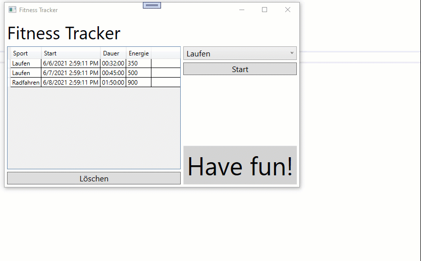

# Fitness Tracker

## Einleitung

Ihre Aufgabe ist die Entwicklung eines rudimentären Fitness Trackers. Die Software wird später als Teil eines neuartigen Fitnessgeräts ausgeliefert. Benutzer*innen können mit Ihrer Software ihre Aktivitäten aufzeichnen.

## Funktionale Anforderungen

* Benutzer*innen können aus zwei Sportarten wählen:
  * Laufen
  * Radfahren

* Benutzer*innen können Aktivitäten starten. Wenn sie fertig sind, können sie die Aktivität stoppen. Nach dem Stoppen wird die Aktivität in die Sport-Historie übernommen.

* Pro Aktivität werden folgende Daten in der Sport-Historie gespeichert:
  * Sportart
  * Startzeitpunkt (Datum und Zeit)
  * Dauer der Aktivität (gerundet auf ganze Sekunden)
  * Schätzung der verbrauchten Kilokalorien (gerundet auf zwei Nachkommastellen)

* Benutzer*innen können Aktivitäten aus der Sport-Historie löschen.

* Speichern Sie die Sport-Historie im Hauptspeicher. Sie müssen die Historie nicht in eine DB oder eine Datei schreiben.

* Die Schätzung der verbrauchten Kilokalorien muss von Ihrer Software wie folgt berechnet werden:
  * Laufen: 400 kcal pro 30 Minuten Aktivität
  * Radfahren: 350 kcal pro 30 Minuten Aktivität

## UI Design

Eine Grafikerin hat einen Prototypen erstellt. Ihre Software soll vom UI-Verhalten und von der UI-Funktionalität möglichst ähnlich aussehen (inkl. Skalierungsverhalten beim Vergrößern des Fensters, Ändern der Button-Beschriftung von "Start" auf "Stop" und zurück). Abweichungen beim grafischen Design (z.B. Schriftgrößen, Farben, etc.) sind erlaubt.

## Nicht-funktionale Anforderungen

Verwenden Sie WPF und .NET 5.

## Bewertungskriterien

Folgende Anforderungen müssen erfüllt sein, um diese Prüfung positiv zu absolvieren:

* Code kompiliert und lässt sich ohne abzustürzen starten.
* XAML Layout ist umgesetzt und entspricht im Wesentlichen den Anforderungen.
* Man kann eine Aktivität durch Drücken eines Buttons starten, danach stoppen und es wird eine Zeile in die Historie eingefügt. Der Energieverbraucht muss dabei nicht berechnet werden.

Bei der Benotung wird insbesondere auf folgende Punkte geachtet:

* Vollständigkeit der Umsetzung aller Anforderungen
* Richtige Anwendung der gelernten XAML-Strukturen (z.B. Styles)
* Richtiger Einsatz von Data Binding
* Richtige Berechnung des Energieverbrauchs
* Korrekter und sauberer Code
