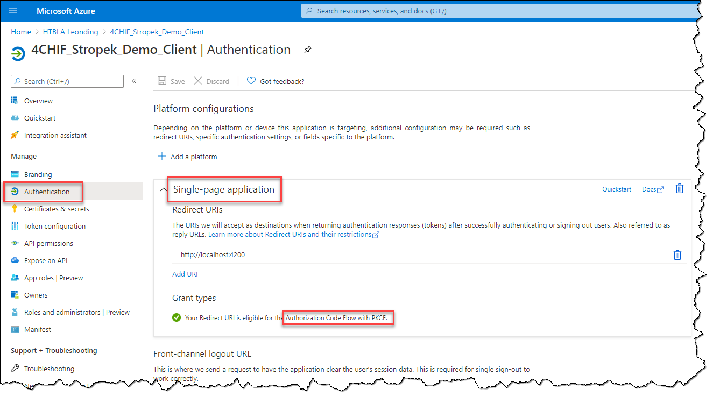
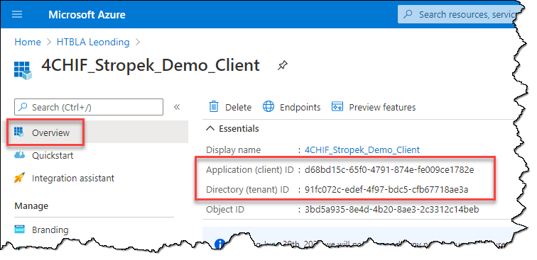

# ASP.NET Core Security

Protecting web APIs with *OpenID Connect* and *Azure Active Directory*

---

## What is *OpenID Connect*?

* Standard for delegates access
* [Website](https://openid.net/)
* [Simplified conceptual diagram](https://slides.com/rainerstropek/aad-auth-for-apis/fullscreen#/2/0/0)
* Here: Tutorial for using OIDC with our school's *Azure Active Directory* (AAD)

---

## Step 1: Register Angular App

* Follow [instructions in AAD docs](https://docs.microsoft.com/en-us/azure/active-directory/develop/scenario-spa-app-registration#create-the-app-registration)
* Specify the [redirect URI as specified here](https://docs.microsoft.com/en-us/azure/active-directory/develop/scenario-spa-app-registration#redirect-uri-msaljs-20-with-auth-code-flow)



---

## Step 2: Create Angular App

* Create Angular app using *Angular CLI*: `ng new simple-web-auth --minimal --skip-git --style css --routing false --strict --dry-run`
* Install [*Microsoft Identity Platform* packages for AAD](https://github.com/AzureAD/microsoft-authentication-library-for-js/tree/dev/lib/msal-angular):
  * `npm install @azure/msal-angular@2.0.0-alpha.6 @azure/msal-browser`
  * `npm install --save-dev @microsoft/microsoft-graph-types`
* Note: At the time of writing, *@azure/msal-angular* was only available as a preview version. Check [on npmjs.com](https://www.npmjs.com/package/@azure/msal-angular) whether a final version is already available.

---

## Step 3: Add Configuration

* In your Angular app, open *src/environments/environment.ts*.
* Add two settings `aadClientId` and `aadTenantId`:

```js
export const environment = {
  production: false,
  aadClientId: 'f1c162e7-75cc-45af-95bb-dc0419a285a3',
  aadTenantId: '91fc072c-edef-4f97-bdc5-cfb67718ae3a',
};
```

* You find the values for these settings in your Azure portal in your registered app:
  

---

## Step 4: Add AAD Configuration to Angular

* Create *src/app/msal.ts*
  * Copy code from [this gist](https://gist.github.com/rstropek/0462065193c1d9667055c042abb74cc5#file-msal-ts)
  * Make yourself familiar with the code
* Open *src/app/app.module.ts*
  * Copy code from [this gist](https://gist.github.com/rstropek/0462065193c1d9667055c042abb74cc5#file-app-module-ts)
  * Make yourself familiar with the code
