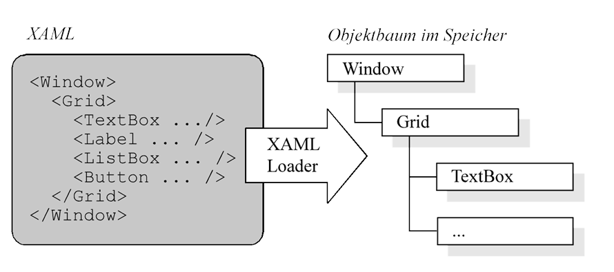
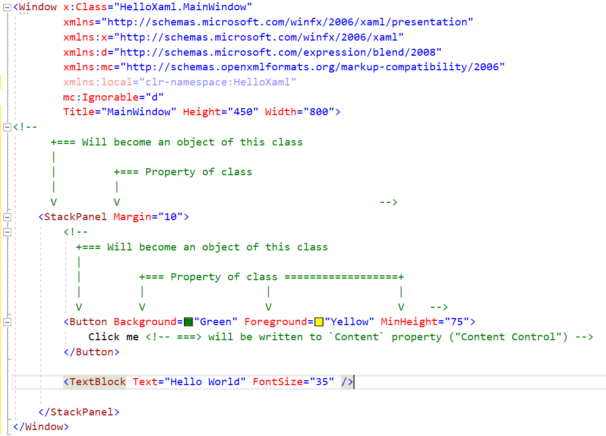
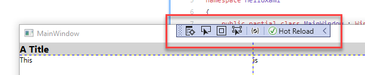

# XAML Introduction

Extensible Application Markup Language

---

## What is XAML?

* Markup language
  * Can be used as a text representation of nearly any kind of data
  * In practice: Used to create user interfaces
  * Other applications possible (e.g. describing workflows)
* Where is XAML used?
  * Windows Presentation Foundation (WPF) for .NET Core
  * WinUI 3
  * Universal Windows Platform (UWP) apps
  * Xamarin Forms, MAUI
  * Etc.
  * ==> Learn once, apply on many platforms

---

## Differences to HTML

* Different sweet spots
  * HTML describes "documents"
  * XAML describes "applications" (UIs)
* Different systems for styling
  * CSS vs. XAML styles/templates

---

## Deserialization Logic

---

## [Deserialization Logic](https://gist.github.com/rstropek/0239c9deba14943c8de7a1f0778abcd7#file-010-mainwindow-xaml)

---

## Build UI in Code

* All you can do in XAML can be done in C#, too
* [Example](https://gist.github.com/rstropek/0239c9deba14943c8de7a1f0778abcd7#file-020-mainwindow-cs)

---

## XAML Browser, Hot Reload

---

## Namespaces

* WPF: `http://schemas.microsoft.com/winfx/2006/xaml/presentation`
  * [Related WPF namespaces](https://docs.microsoft.com/en-us/windows/uwp/xaml-platform/xaml-namespaces-and-namespace-mapping#code-namespaces-that-map-to-the-default-xaml-namespace)
* XAML: `xmlns:x="http://schemas.microsoft.com/winfx/2006/xaml"`
  * Primarily for [resource dictionaries](https://docs.microsoft.com/en-us/windows/uwp/design/controls-and-patterns/resourcedictionary-and-xaml-resource-references)
* VS Designer support:
  * `http://schemas.microsoft.com/expression/blend/2008`
  * `http://schemas.openxmlformats.org/markup-compatibility/2006`
* `xmlns:local="clr-namespace:HelloXaml"` for referencing custom .NET namespaces
  * Local namespaces for current project/solution

---

## Important Panels for this Course

* Used to arrange other controls
* [`System.Windows.Controls.DockPanel`](https://gist.github.com/rstropek/0239c9deba14943c8de7a1f0778abcd7#file-040-dock-panel-menu-xaml)
* [`System.Windows.Controls.Grid`](https://gist.github.com/rstropek/0239c9deba14943c8de7a1f0778abcd7#file-030-grid-xaml)
* `System.Windows.Controls.Primitives.TabPanel`
* [`System.Windows.Controls.StackPanel`](https://gist.github.com/rstropek/0239c9deba14943c8de7a1f0778abcd7#file-035-stackpanel-xaml)
* [`System.Windows.Controls.WrapPanel`](https://gist.github.com/rstropek/0239c9deba14943c8de7a1f0778abcd7#file-050-wrap-panel-styles-xaml)

---

## Forms

* `TextBlock`
* `TextBox`
* `DatePicker`
* `Button`
* `Slider`
* [Example](https://gist.github.com/rstropek/0239c9deba14943c8de7a1f0778abcd7#file-080-form-cs)
