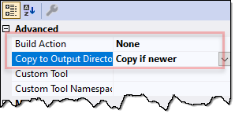

# EF/ASP.NET Cheat Sheet

## Install EF

* [Documentation...](https://docs.microsoft.com/en-us/ef/core/get-started/)

* Install EF Tools globally
  * `dotnet tool install --global dotnet-ef`
  * Update with `dotnet tool update --global dotnet-ef` (add `--version ...` to install a prerelease)
* `dotnet add package Microsoft.EntityFrameworkCore.SqlServer`
  * [Choose your DB provider...](https://docs.microsoft.com/en-us/ef/core/providers/)
* `dotnet add package Microsoft.EntityFrameworkCore.Design`
* If you want to print generated SQL statements: `dotnet add package Microsoft.Extensions.Logging.Console`
* To read *appsettings.json*, add: `dotnet add package Microsoft.Extensions.Configuration.Json`
  * Note: Not necessary in ASP.NET

## Create *Model*

* [Documentation...](https://docs.microsoft.com/en-us/ef/core/modeling/)

* Consider *conventions*
  * Property named `Id` or `<type name>Id` -> *key* of an entity
  * Keys that are `int` or `Guid` -> *generated values on add*
  * Nullable CLR types (e.g. `string`, `int?`, `byte[]`) -> optional (string, int?, byte[], etc.)<br/>
    Not nullable CLR types (e.g. `decimal`, `int`, `bool`) -> required
  * Default maximum length is provider-specific. Example: SQL Server strings -> `nvarchar(max)`
  * *Shadow properties* will be *auto-created* in the DB for foreign keys if no foreign key property is found in the dependent class.
  * *Index* is created for each property that is used as a foreign key
  * Name of the `DbSet<TEntity>` property -> table name<br/>, if not property exists, class name -> table name
  * Default behavior for inheritance: *Table-per-Hierarchy (TPH)*

* Configure your model using...
  * ...*Fluent API* in [`DbContext.OnModelCreating`](https://docs.microsoft.com/en-us/dotnet/api/microsoft.entityframeworkcore.dbcontext.onmodelcreating) or
  * ...*Data Annotations*
  * [Documentation...](https://docs.microsoft.com/en-us/ef/core/modeling/#use-fluent-api-to-configure-a-model)

```csharp
// Fluent API Example:

class MyContext : DbContext
{
    public DbSet<Blog> Blogs { get; set; }

    protected override void OnModelCreating(ModelBuilder modelBuilder)
    {
        modelBuilder.Entity<Blog>()
            .Property(b => b.Url)
            .IsRequired();
    }
}
```

If you want to/need to disable *Cascade Delete*:

```csharp
protected override void OnModelCreating(ModelBuilder modelBuilder)
{
    modelBuilder.Entity<OrderHeader>()
                .HasMany(h => h.OrderDetails)
                .WithOne(d => d.OrderHeader)
                .HasForeignKey(d => d.OrderHeaderID)
                .OnDelete(DeleteBehavior.NoAction);
}
```

```csharp
// Data Annotations Example:

public class Blog
{
    public int BlogId { get; set; }
    [Required]
    public string Url { get; set; }
}
```

## Connection String in `appsettings.json`

* [Documentation...](https://docs.microsoft.com/en-us/ef/core/miscellaneous/connection-strings#aspnet-core)

* Create *appsettings.json* file:

```json
{
  "ConnectionStrings": {
    "DefaultConnection": "Server=(localdb)\\MSSQLLocalDB;Database=AddressBook;Trusted_Connection=True"
  }
}
```

* Don't forget to *copy the file to output directory* if you build a console app. In ASP.NET Core, this is done automatically.
  

* Read connection string in ASP.NET Core's startup class:

```csharp
public class Startup
{
    private IConfiguration configuration;

    public Startup(IConfiguration configuration)
    {
        this.configuration = configuration;
    }

    public void ConfigureServices(IServiceCollection services)
    {
        ...
        services.AddDbContext<AddressBookContext>(options => options.UseSqlServer(
            Configuration["ConnectionStrings:DefaultConnection"]));
        ...
    }

    ...
}
```

## Create a *DbContext*

* [Documentation...](https://docs.microsoft.com/en-us/ef/core/miscellaneous/configuring-dbcontext)

* `DbContextOptions` in Constructor:

```csharp
public class BloggingContext : DbContext
{
    public BloggingContext(DbContextOptions<BloggingContext> options)
        : base(options)
    { }

    public DbSet<Blog> Blogs { get; set; }
}
```

* Add `DbContext` to ASP.NET Core Dependency Injection:

```csharp
public void ConfigureServices(IServiceCollection services)
{
    services.AddDbContext<BloggingContext>(options => options.UseSqlServer(
        configuration["ConnectionStrings:DefaultConnection"]));
}
```

* Add DbContext factory in case of console apps:

```cs
class BloggingContextFactory : IDesignTimeDbContextFactory<BloggingContext>
{
    public BloggingContext CreateDbContext(string[]? args = null)
    {
        var configuration = new ConfigurationBuilder().AddJsonFile("appsettings.json").Build();

        var optionsBuilder = new DbContextOptionsBuilder<BloggingContext>();
        optionsBuilder
            // Uncomment the following line if you want to print generated
            // SQL statements on the console.
            // .UseLoggerFactory(LoggerFactory.Create(builder => builder.AddConsole()))
            .UseSqlServer(configuration["ConnectionStrings:DefaultConnection"]);

        return new BloggingContext(optionsBuilder.Options);
    }
}
```

* Option: Add logging ([documentation...](https://docs.microsoft.com/en-us/ef/core/miscellaneous/logging))

```csharp
public static readonly ILoggerFactory MyLoggerFactory
    = LoggerFactory.Create(builder => { builder.AddConsole(); });
...

protected override void OnConfiguring(DbContextOptionsBuilder optionsBuilder)
    => optionsBuilder.UseLoggerFactory(MyLoggerFactory);
```

* Option: Switch to *Newtonsoft.Json* by installing the `Microsoft.AspNetCore.Mvc.NewtonsoftJson` NuGet package and adding the following code to *Startup.cs* ([documentation...](https://docs.microsoft.com/en-us/aspnet/core/migration/22-to-30?view=aspnetcore-3.0&tabs=visual-studio#jsonnet-support)):

```csharp
public void ConfigureServices(IServiceCollection services)
{
    ...
    services.AddControllers().AddNewtonsoftJson(settings =>
        settings.SerializerSettings.ReferenceLoopHandling = ReferenceLoopHandling.Ignore);
    ...
}
```

## Query Data

* [Documentation](https://docs.microsoft.com/en-us/ef/core/querying/)

|       Task        |                    Operation                    |
| ----------------- | ----------------------------------------------- |
| Load all data     | `ToListAsync`                                   |
| Load single row   | `Single`                                        |
| Filter            | `Where`                                         |
| Load related data | `Include`, `ThenInclude`, `Entry`, `Collection` |
| No-tracking query | `AsNoTracking`                                  |
| Raw SQL queries   | `FromSql`                                       |
| Sorting           | `OrderBy`, `OrderByDescending`                  |

## Saving Data

* [Documentation](https://docs.microsoft.com/en-us/ef/core/saving/)

|      Task       |     Operation      |
| --------------- | ------------------ |
| Add instance    | `Add`              |
| Delete instance | `Remove`           |
| Save            | `SaveChangesAsync` |

* Transactions:

```csharp
using (var transaction = context.Database.BeginTransaction())
{
    try
    {
        ...
        context.SaveChanges();
        ...
        context.SaveChanges();
        transaction.Commit();
    }
    catch (Exception)
    {
        // TODO: Handle failure
    }
}
```

* Set state of external object to *modified*: `context.Entry(obj).State = EntityState.Modified;`

## Manage DB Schema

* [Documentation](https://docs.microsoft.com/en-us/ef/core/managing-schemas/)

* Add Migration: `dotnet ef migrations add <MigrationName>`
* Update target database: `dotnet ef database update`
* Remove last Migration: `dotnet ef migrations remove`
* Generate SQL script from Migrations: `dotnet ef migrations script`
